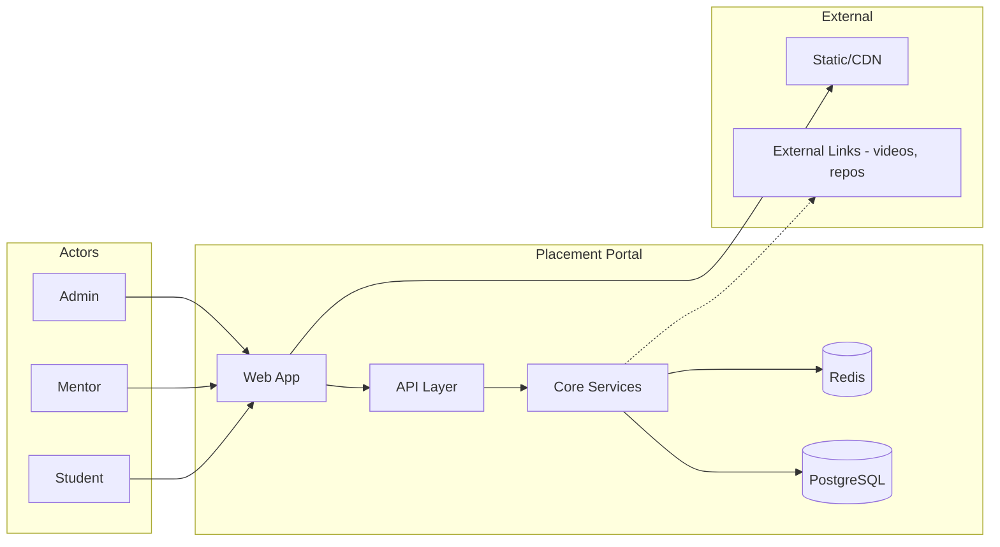
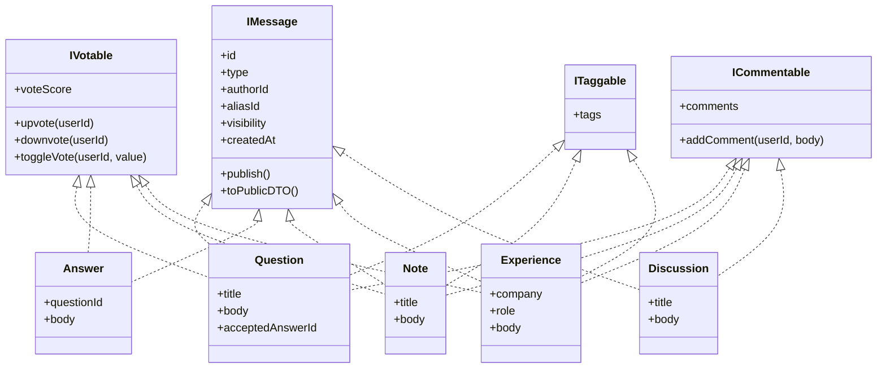
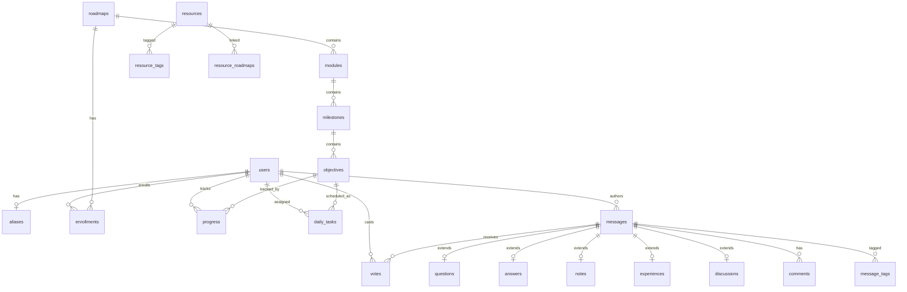
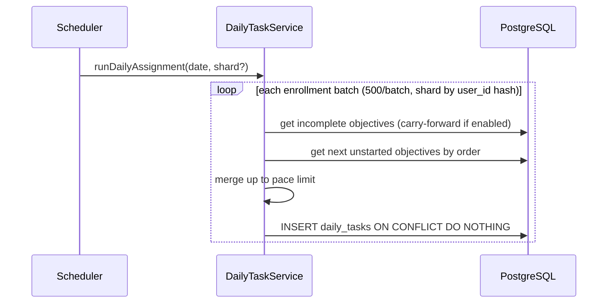
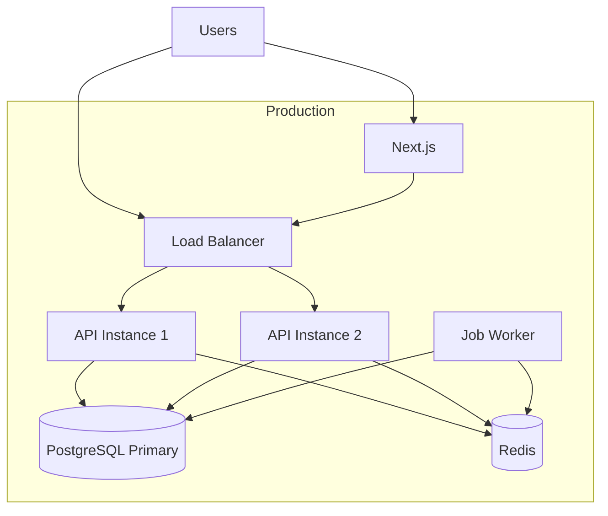

# Placement Portal — High-Level Design (HLD)

## 1. Overview

A web platform where students follow structured learning roadmaps, complete daily objectives, earn XP, compete on leaderboards, and collaborate via a unified **Message** community layer (Q&A, notes, interview experiences). The design prioritizes **SOLID extensibility** (new message types without touching vote/publish core), **semi-anonymous identity**, and **sub-500ms** reads for daily tasks and leaderboards.

---

## 2. System Context



| Actor | Primary capabilities |
|-------|---------------------|
| **Student** | Enroll, daily tasks, progress, community posts, voting |
| **Mentor** | Submit/curate resources, moderate community, review flags |
| **Admin** | Publish roadmaps, resolve anonymity, audit, approve resources |

---

## 3. Architecture Style

**Modular monolith (v1)** with clear bounded contexts. Split to microservices only if load or team boundaries demand it (leaderboard + search are natural extraction candidates in Phase 2).

```
┌─────────────────────────────────────────────────────────────┐
│                     Client (Responsive Web)                  │
│              Next.js / React — SSR for SEO on public feeds   │
└────────────────────────────┬────────────────────────────────┘
                             │ HTTPS + JWT
┌────────────────────────────▼────────────────────────────────┐
│                      API Gateway / BFF                       │
│         Auth middleware · Rate limiting · Request routing    │
└────────────────────────────┬────────────────────────────────┘
                             │
     ┌───────────────────────┼───────────────────────┐
     │                       │                       │
┌────▼─────┐  ┌──────────────▼──────────────┐  ┌─────▼─────┐
│ Identity │  │      Learning Domain        │  │ Community │
│ & Access │  │ Roadmaps · Progress · Daily │  │ Messages  │
└────┬─────┘  └──────────────┬──────────────┘  └─────┬─────┘
     │                       │                       │
     │              ┌────────▼────────┐              │
     │              │ Gamification    │              │
     │              │ XP · Streak · LB│              │
     │              └────────┬────────┘              │
     └───────────────────────┼───────────────────────┘
                             │
              ┌──────────────▼──────────────┐
              │   Shared Infrastructure     │
              │ PostgreSQL · Redis · Jobs   │
              └─────────────────────────────┘
```

---

## 4. Bounded Contexts & Responsibilities

### 4.1 Identity & Access
- Registration/login (email + password; OAuth optional later)
- Roles: `STUDENT`, `MENTOR`, `ADMIN`
- JWT access token (short TTL) + refresh token
- **Alias** entity: one per user for semi-anonymous display name
- Real `author_id` always stored server-side; public API returns alias when `visibility = SEMI_ANONYMOUS`

### 4.2 Learning (Roadmaps & Progress)
- **Roadmap → Module → Milestone → Objective** hierarchy
- Objective types: `READ`, `PRACTICE`, `QUIZ`, `PROJECT`, `MOCK_INTERVIEW`
- Enrollment with configurable **pace** (objectives per day)
- Progress per `(user, objective)`: `NOT_STARTED | IN_PROGRESS | COMPLETED | SKIPPED`

### 4.3 Daily Objectives
- **Scheduler job** (cron, e.g. 00:05 UTC): for each active enrollment, assign N objectives based on pace and incomplete carry-forward
- `daily_tasks(user_id, objective_id, assigned_date)` — idempotent assignment
- Carry-forward controlled per roadmap (`carry_forward` flag)

### 4.4 Gamification
- XP on objective completion (atomic DB function — already modeled in schema)
- Streak: consecutive calendar days with ≥1 completed objective
- Leaderboard scopes: global, per-roadmap, weekly, monthly

### 4.5 Resource Bank
- Curated external links (`ARTICLE`, `VIDEO`, `PDF`, `REPO`)
- Tags + roadmap associations
- Workflow: `PENDING → APPROVED | REJECTED` (mentor/admin)

### 4.6 Community (Unified Message Model)
- Base `messages` row + type-specific extension tables (Class Table Inheritance)
- Capabilities applied via interfaces, not inheritance trees in DB

### 4.7 Moderation & Audit
- Flag/report flow, resource approval, admin anonymity resolution
- All admin actions → `audit_logs`

---

## 5. Core Domain Model — Message & Capability Interfaces

The requirements call for segregated interfaces. Implement as **capability flags + handler registry** in application code, backed by schema constraints.



| Message Type | IVotable | ICommentable | ITaggable | Semi-anonymous |
|--------------|----------|--------------|-----------|----------------|
| Question | ✓ | ✓ | ✓ | ✓ |
| Answer | ✓ | ✓ | — | ✓ |
| Note | ✓ | ✓ | ✓ | ✓ |
| Experience | ✓ | ✓ | ✓ | ✓ |
| Discussion | ✗ | ✓ | ✓ | ✓ |
| Announcement (future) | ✗ | ✗ | — | ✗ |

**Handler registry pattern:**

```
MessageTypeRegistry
  ├── QuestionHandler  (validator + serializer + capabilities: [VOTABLE, COMMENTABLE, TAGGABLE])
  ├── AnswerHandler
  ├── NoteHandler
  ├── ExperienceHandler
  └── DiscussionHandler (capabilities: [COMMENTABLE, TAGGABLE] only)

VoteService     → checks message.type ∈ VOTABLE_TYPES before any write
CommentService  → checks ICommentable
PublishService  → delegates to MessageTypeRegistry.get(type).validate + persist
```

Adding **Mock Interview** (future community type): register new handler; no changes to `VoteService` or `PublishService`.

---

## 6. Data Model (Logical)

Aligns with your existing [`supabase/schema.sql`](supabase/schema.sql).



**Key constraints:**
- `votes`: `UNIQUE(user_id, message_id)` — idempotent toggle (upsert or delete)
- `progress`: `UNIQUE(user_id, objective_id)`
- `daily_tasks`: `UNIQUE(user_id, objective_id, assigned_date)`
- Votes only allowed when `messages.type IN ('QUESTION','ANSWER','NOTE','EXPERIENCE')` — enforced in service layer + DB trigger
- `messages.vote_score INT DEFAULT 0` — denormalized aggregate updated atomically in vote transaction (avoids `COUNT(*)` on hot reads)

**Supporting tables (v1 additions):**
- `outbox_events` — reliable delivery of `XpAwardedEvent` to Redis worker
- `refresh_tokens` — hashed refresh token storage for rotation

---

## 7. Key Flows

### 7.1 Daily Objective Assignment



**Rules:**
1. Pool = carry-forward incomplete + next objectives in roadmap order not yet in progress/completed
2. Cap at `enrollment.pace` tasks per day
3. Mark carry-forward rows with `carry_forward = true`
4. **Backlog cap:** max 3 carry-forward tasks per enrollment to prevent pile-up
5. **Sharding:** `shard = hash(user_id) % 4` for parallel worker instances

### 7.2 Complete Objective (XP + Streak)

Already atomic via `complete_objective()` stored procedure:
1. Upsert `progress` → `COMPLETED`
2. Mark today's `daily_tasks` row completed
3. Increment user XP by `objective.xp_reward`
4. Update streak (same day = no change; +1 day = increment; gap > 1 = reset to 1)
5. Emit `XpAwardedEvent` → outbox → **LeaderboardWorker** updates Redis sorted sets

### 7.3 Vote Toggle (Idempotent)

```
POST /messages/:id/vote  { value: 1 | -1 }

1. Load message; reject if type ∉ VOTABLE_TYPES
2. Rate-limit check (user + IP)
3. BEGIN TRANSACTION
   - SELECT vote FOR UPDATE WHERE user_id, message_id
   - IF no row → INSERT
   - IF same value → DELETE (toggle off)
   - IF different value → UPDATE value
4. COMMIT (update `messages.vote_score` in same transaction)
5. Return `{ score: message.vote_score, userVote: 1 | -1 | null }`
```

### 7.4 Semi-Anonymous Publish

```
POST /questions  { title, body, visibility: "SEMI_ANONYMOUS" }

1. Ensure user has alias (auto-create if missing)
2. INSERT messages (author_id=real, alias_id=alias, visibility)
3. INSERT questions extension row
4. Public response: { author: { displayName: alias.display_name }, ... }
   — never expose author_id to non-admin callers
```

### 7.5 Admin Anonymity Resolution

```
GET /admin/messages/:id/author  (ADMIN only)

→ Returns real user + audit_log entry { action: "RESOLVE_ANONYMITY", target_id }
```

---

## 8. Leaderboard Design

Leaderboards use **increment-on-write** (not cache-aside on first read). Redis sorted sets are updated when XP is earned; reads never hit PostgreSQL in the happy path.

### 8.1 Write path (primary)

After `complete_objective()` commits in PostgreSQL:

1. API publishes `XpAwardedEvent { userId, xpDelta, roadmapId, occurredAt }` to a **transactional outbox** table (same DB transaction boundary via app orchestration, or immediate publish with retry).
2. **LeaderboardWorker** consumes the event and runs:
   - `ZINCRBY pp:lb:global {xpDelta} {userId}`
   - `ZINCRBY pp:lb:roadmap:{roadmapId} {xpDelta} {userId}`
   - `ZINCRBY pp:lb:weekly:{YYYY-Www} {xpDelta} {userId}` (TTL 56 days)
   - `ZINCRBY pp:lb:monthly:{YYYY-MM} {xpDelta} {userId}` (TTL 90 days)

Weekly/monthly keys track **XP earned in that period**, not lifetime XP.

### 8.2 Read path (< 500ms)

```
ZREVRANGE pp:lb:global 0 99 WITHSCORES
ZREVRANGE pp:lb:roadmap:{id} 0 99 WITHSCORES
ZREVRANGE pp:lb:weekly:{YYYY-Www} 0 99 WITHSCORES
ZREVRANGE pp:lb:monthly:{YYYY-MM} 0 99 WITHSCORES
```

Hydrate display names from a short-TTL cache (`pp:user:profile:{userId}`, 5 min) or batch-fetch from `users`/`aliases`.

### 8.3 Reconciliation cron (secondary — drift correction only)

| Job | Schedule | Purpose |
|-----|----------|---------|
| `rebuildLeaderboard` | Hourly | Full sync Redis from PostgreSQL when drift detected or after Redis restart |
| `seedLeaderboard` | On deploy / Redis flush | One-time bootstrap from `users.xp` before incremental updates resume |

The cron job does **not** populate cache on first user query; it fixes missed increments or cold starts.

### 8.4 Fallback

If Redis is unavailable: serve last-known snapshot (optional JSON blob in PostgreSQL `leaderboard_snapshots`) or compute top-N from `users` (degraded mode; alert ops).

---

## 9. API Surface (High-Level)

| Domain | Endpoints (representative) |
|--------|---------------------------|
| **Auth** | `POST /auth/register`, `POST /auth/login`, `POST /auth/refresh` |
| **Profile** | `GET /me`, `PATCH /me/alias` |
| **Roadmaps** | `GET /roadmaps`, `GET /roadmaps/:slug`, `POST /enrollments` |
| **Daily** | `GET /daily-tasks?date=today`, `PATCH /daily-tasks/:id/complete` |
| **Progress** | `GET /progress?roadmapId=`, `POST /objectives/:id/complete` |
| **Leaderboard** | `GET /leaderboard?scope=global\|roadmap\|weekly\|monthly` |
| **Resources** | `GET /resources`, `POST /resources`, `PATCH /resources/:id/approve` |
| **Q&A** | `POST /questions`, `POST /questions/:id/answers`, `POST /answers/:id/accept` |
| **Notes/Exp** | `POST /notes`, `POST /experiences` |
| **Votes** | `POST /messages/:id/vote`, `DELETE /messages/:id/vote` |
| **Comments** | `POST /messages/:id/comments` |
| **Moderation** | `POST /reports`, `GET /admin/reports`, `GET /admin/messages/:id/author` |

All list endpoints: cursor-based pagination (`?cursor=&limit=20`).

---

## 10. Cross-Cutting Concerns

### 10.1 Security
| Concern | Approach |
|---------|----------|
| Authentication | JWT (HS256/RS256); refresh in httpOnly cookie |
| Authorization | RBAC middleware: `@Roles('ADMIN')`, resource ownership checks |
| Semi-anonymous privacy | DTO layer strips `author_id`; admin endpoints gated + audited |
| Input validation | Schema validation per message handler (Zod/class-validator) |
| SQL injection | Parameterized queries / ORM |
| Rate limiting | Redis sliding window: posts (10/hr), votes (60/hr), auth (5/min) |

### 10.2 Performance Targets
| Operation | Target | Technique |
|-----------|--------|-----------|
| Daily tasks | < 500ms | Index `(user_id, assigned_date)`; single query with joins |
| Leaderboard | < 500ms | Redis sorted sets; precomputed ranks |
| Community feed | < 500ms | Index `(type, created_at DESC)`; keyset pagination |
| Resource search | < 500ms | Tag/roadmap filters on indexed columns; Phase 2 → Elasticsearch/Meilisearch |

### 10.3 Availability (99.9%)
- Stateless API behind load balancer (2+ instances)
- PostgreSQL with automated backups + read replica (optional v1.1)
- Redis Sentinel or managed Redis for leaderboard cache
- Health checks: `/health` (DB + Redis ping)

### 10.4 Background Jobs
| Job | Schedule | Purpose |
|-----|----------|---------|
| `assignDailyTasks` | Daily 00:05 UTC | Create daily_tasks rows (batched, sharded) |
| `processOutbox` | Every 10s | Deliver XpAwardedEvent → Redis |
| `rebuildLeaderboard` | Hourly | Reconcile Redis from DB (drift correction) |
| `seedLeaderboard` | On deploy | Bootstrap Redis from `users.xp` |
| `notifyDailyTasks` | Daily 08:00 UTC | In-app notifications |

---

## 11. Technology Stack (Recommended)

| Layer | Choice | Rationale |
|-------|--------|-----------|
| Frontend | Next.js 14+ (App Router) | SSR for public feeds, responsive first |
| API | Node.js (NestJS) or Next.js Route Handlers | Interface segregation maps cleanly to Nest modules |
| Database | PostgreSQL (Supabase) | Existing schema, ACID, stored procs for atomic XP |
| Cache | Redis (Upstash / ElastiCache) | Leaderboards, rate limits, session blacklist |
| Auth | JWT + bcrypt | Requirement-mandated |
| Jobs | node-cron / BullMQ | Daily assignment, LB rebuild |
| Hosting | Vercel (web) + Railway/Fly (API) or monolithic Vercel | Simple ops for v1 |

---

## 12. Deployment View



---

## 13. Extensibility — Adding a New Message Type

Example: **Announcement** (admin-only, non-votable)

1. Add `ANNOUNCEMENT` to `messages.type` CHECK constraint
2. Create `announcements` extension table
3. Implement `AnnouncementHandler implements IMessage` (not IVotable)
4. Register in `MessageTypeRegistry`
5. Add admin-only route `POST /admin/announcements`

**No changes** to `VoteService`, `CommentService` (unless ICommentable), or core `PublishService`.

---

## 14. Phase 2 (Out of Scope v1)

| Feature | Design Hook |
|---------|-------------|
| Full-text search | Index messages/resources in Meilisearch; sync via outbox pattern |
| Real-time chat | Separate WebSocket service; not on Message model |
| Mobile apps | Same REST/GraphQL API |
| OAuth | Identity provider abstraction behind `IAuthProvider` |

---

## 15. Risks & Mitigations

| Risk | Mitigation |
|------|------------|
| Leaderboard drift vs DB | Hourly reconciliation job |
| Vote spam | Rate limits + unique constraint |
| Anonymity abuse | Reports + admin resolve + optional shadow-ban |
| Daily job failure | Idempotent assignment; alert + manual re-run endpoint |
| Carry-forward task pile-up | Cap backlog; surface "overdue" UI; admin pace guidance |

---

## 16. Summary

The Placement Portal is a **modular monolith** with five bounded contexts (Identity, Learning, Gamification, Resources, Community) unified by a **Message + capability interface** pattern. PostgreSQL holds source of truth; Redis holds leaderboard sorted sets updated via **increment-on-write** with outbox-backed reliability. Semi-anonymous identity is a **presentation-layer concern** backed by always-stored real `author_id` and admin audit trails.

**Detailed implementation:** see [`lld.md`](lld.md).