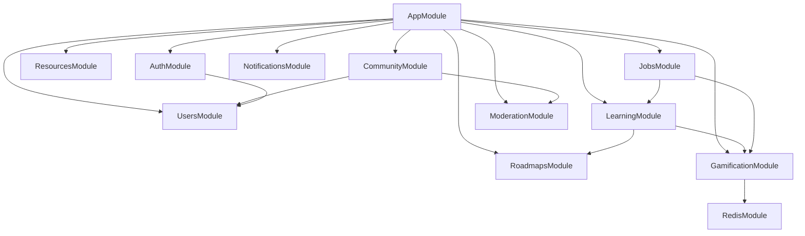

# Placement Portal — Low-Level Design (LLD)

> **Companion document:** [`hld.md`](hld.md)  
> **Schema reference:** [`supabase/schema.sql`](supabase/schema.sql)  
> **Stack:** Next.js 14 (App Router) + NestJS 10 + PostgreSQL (Supabase) + Redis + BullMQ

---

## 1. Document Scope

This LLD specifies **implementable** details: folder layout, NestJS modules, TypeScript interfaces, DTOs, SQL queries, Redis keys, job handlers, API contracts, and error codes. It is the blueprint for v1 implementation.

---

## 2. Repository Structure

```
placement-prep/
├── apps/
│   ├── web/                          # Next.js 14 frontend
│   │   ├── app/
│   │   │   ├── (auth)/login/page.tsx
│   │   │   ├── (auth)/register/page.tsx
│   │   │   ├── dashboard/page.tsx
│   │   │   ├── roadmaps/[slug]/page.tsx
│   │   │   ├── daily/page.tsx
│   │   │   ├── leaderboard/page.tsx
│   │   │   ├── resources/page.tsx
│   │   │   ├── community/
│   │   │   │   ├── questions/page.tsx
│   │   │   │   ├── questions/[id]/page.tsx
│   │   │   │   ├── notes/page.tsx
│   │   │   │   └── experiences/page.tsx
│   │   │   └── admin/
│   │   ├── components/
│   │   ├── lib/api-client.ts         # Typed fetch wrapper
│   │   └── lib/auth.ts
│   │
│   └── api/                          # NestJS backend
│       ├── src/
│       │   ├── main.ts
│       │   ├── app.module.ts
│       │   ├── common/
│       │   │   ├── decorators/       # @CurrentUser, @Roles
│       │   │   ├── filters/          # HttpExceptionFilter
│       │   │   ├── guards/           # JwtAuthGuard, RolesGuard
│       │   │   ├── interceptors/     # LoggingInterceptor
│       │   │   ├── pipes/            # ZodValidationPipe
│       │   │   └── dto/              # PaginationDto, ApiResponse
│       │   ├── config/               # env validation (Zod)
│       │   ├── database/
│       │   │   ├── prisma.service.ts # or Drizzle/Kysely
│       │   │   └── migrations/
│       │   ├── redis/
│       │   │   └── redis.module.ts
│       │   ├── modules/
│       │   │   ├── auth/
│       │   │   ├── users/
│       │   │   ├── roadmaps/
│       │   │   ├── learning/         # enrollments, progress, daily
│       │   │   ├── gamification/     # xp, streak, leaderboard
│       │   │   ├── resources/
│       │   │   ├── community/        # messages, votes, comments
│       │   │   ├── moderation/
│       │   │   ├── notifications/
│       │   │   └── jobs/             # BullMQ processors
│       │   └── domain/               # Pure domain types & interfaces
│       │       ├── message/
│       │       │   ├── i-message.ts
│       │       │   ├── i-votable.ts
│       │       │   ├── i-commentable.ts
│       │       │   ├── i-taggable.ts
│       │       │   ├── message-type.registry.ts
│       │       │   └── handlers/
│       │       └── events/
│       └── test/
│
├── packages/
│   └── shared/                       # Shared Zod schemas & types
│       ├── schemas/
│       └── types/
│
├── supabase/
│   ├── schema.sql
│   └── migrations/
│       ├── 001_initial.sql
│       └── 002_outbox_vote_score.sql
│
├── hld.md
├── lld.md
└── docker-compose.yml                  # postgres + redis for local dev
```

---

## 3. NestJS Module Dependency Graph



| Module | Exports | Imports |
|--------|---------|---------|
| `AuthModule` | `AuthService`, `JwtAuthGuard` | `UsersModule`, `JwtModule` |
| `UsersModule` | `UsersService`, `AliasService` | `DatabaseModule` |
| `RoadmapsModule` | `RoadmapsService` | `DatabaseModule` |
| `LearningModule` | `EnrollmentService`, `ProgressService`, `DailyTaskService` | `RoadmapsModule`, `GamificationModule` |
| `GamificationModule` | `XpService`, `LeaderboardService`, `OutboxService` | `RedisModule`, `DatabaseModule` |
| `CommunityModule` | `PublishService`, `VoteService`, `CommentService`, `FeedService` | `UsersModule`, domain registry |
| `JobsModule` | — | `BullModule`, all domain modules |

---

## 4. Domain Interfaces (TypeScript)

### 4.1 Core message interfaces

```typescript
// apps/api/src/domain/message/capabilities.ts
export enum MessageCapability {
  VOTABLE = 'VOTABLE',
  COMMENTABLE = 'COMMENTABLE',
  TAGGABLE = 'TAGGABLE',
}

export enum MessageType {
  QUESTION = 'QUESTION',
  ANSWER = 'ANSWER',
  NOTE = 'NOTE',
  EXPERIENCE = 'EXPERIENCE',
  DISCUSSION = 'DISCUSSION',
}

export enum Visibility {
  PUBLIC = 'PUBLIC',
  SEMI_ANONYMOUS = 'SEMI_ANONYMOUS',
  PRIVATE = 'PRIVATE',
}

export const VOTABLE_TYPES: ReadonlySet<MessageType> = new Set([
  MessageType.QUESTION,
  MessageType.ANSWER,
  MessageType.NOTE,
  MessageType.EXPERIENCE,
]);

export const COMMENTABLE_TYPES: ReadonlySet<MessageType> = new Set([
  MessageType.QUESTION,
  MessageType.NOTE,
  MessageType.EXPERIENCE,
  MessageType.DISCUSSION,
]);
```

```typescript
// apps/api/src/domain/message/i-message.ts
export interface IMessage<TPayload = unknown> {
  readonly type: MessageType;
  readonly capabilities: ReadonlySet<MessageCapability>;
  validateCreate(input: unknown): TPayload;
  validateUpdate?(input: unknown): Partial<TPayload>;
  toPublicDto(row: MessageRow, ctx: AuthorContext): PublicMessageDto;
}

export interface MessageRow {
  id: string;
  type: MessageType;
  authorId: string;
  aliasId: string | null;
  visibility: Visibility;
  voteScore: number;
  createdAt: Date;
  updatedAt: Date;
}

export interface AuthorContext {
  viewerId?: string;
  viewerRole?: Role;
  aliasDisplayName?: string;
  authorDisplayName?: string;
}
```

```typescript
// apps/api/src/domain/message/i-votable.ts
export interface IVotable {
  toggleVote(userId: string, messageId: string, value: 1 | -1): Promise<VoteResult>;
}

export interface VoteResult {
  score: number;
  userVote: 1 | -1 | null;
}
```

```typescript
// apps/api/src/domain/message/message-type.registry.ts
@Injectable()
export class MessageTypeRegistry {
  private readonly handlers = new Map<MessageType, IMessage>();

  constructor(
    questionHandler: QuestionHandler,
    answerHandler: AnswerHandler,
    noteHandler: NoteHandler,
    experienceHandler: ExperienceHandler,
    discussionHandler: DiscussionHandler,
  ) {
    this.handlers.set(MessageType.QUESTION, questionHandler);
    this.handlers.set(MessageType.ANSWER, answerHandler);
    this.handlers.set(MessageType.NOTE, noteHandler);
    this.handlers.set(MessageType.EXPERIENCE, experienceHandler);
    this.handlers.set(MessageType.DISCUSSION, discussionHandler);
  }

  get(type: MessageType): IMessage {
    const handler = this.handlers.get(type);
    if (!handler) throw new DomainError('UNKNOWN_MESSAGE_TYPE', type);
    return handler;
  }

  assertVotable(type: MessageType): void {
    if (!VOTABLE_TYPES.has(type)) {
      throw new DomainError('MESSAGE_NOT_VOTABLE', type);
    }
  }

  assertCommentable(type: MessageType): void {
    if (!COMMENTABLE_TYPES.has(type)) {
      throw new DomainError('MESSAGE_NOT_COMMENTABLE', type);
    }
  }
}
```

### 4.2 Handler example — QuestionHandler

```typescript
@Injectable()
export class QuestionHandler implements IMessage<CreateQuestionPayload> {
  readonly type = MessageType.QUESTION;
  readonly capabilities = new Set([
    MessageCapability.VOTABLE,
    MessageCapability.COMMENTABLE,
    MessageCapability.TAGGABLE,
  ]);

  validateCreate(input: unknown): CreateQuestionPayload {
    return createQuestionSchema.parse(input);
  }

  toPublicDto(row: MessageRow & QuestionRow, ctx: AuthorContext): QuestionPublicDto {
    return {
      id: row.id,
      type: MessageType.QUESTION,
      title: row.title,
      body: row.body,
      voteScore: row.voteScore,
      acceptedAnswerId: row.acceptedAnswerId,
      visibility: row.visibility,
      author: resolveAuthor(row, ctx),
      tags: row.tags ?? [],
      createdAt: row.createdAt.toISOString(),
    };
  }
}
```

---

## 5. Schema Additions (Migration 002)

Apply on top of [`supabase/schema.sql`](supabase/schema.sql):

```sql
-- Denormalized vote score on messages
ALTER TABLE messages ADD COLUMN IF NOT EXISTS vote_score INT NOT NULL DEFAULT 0;

-- Reliable leaderboard event delivery
CREATE TABLE IF NOT EXISTS outbox_events (
  id TEXT PRIMARY KEY DEFAULT gen_random_uuid()::text,
  event_type TEXT NOT NULL,
  payload JSONB NOT NULL,
  status TEXT NOT NULL DEFAULT 'PENDING'
    CHECK (status IN ('PENDING','PROCESSING','COMPLETED','FAILED')),
  attempts INT NOT NULL DEFAULT 0,
  created_at TIMESTAMPTZ NOT NULL DEFAULT now(),
  processed_at TIMESTAMPTZ
);
CREATE INDEX IF NOT EXISTS idx_outbox_pending ON outbox_events(status, created_at)
  WHERE status IN ('PENDING','FAILED');

-- Refresh token rotation
CREATE TABLE IF NOT EXISTS refresh_tokens (
  id TEXT PRIMARY KEY DEFAULT gen_random_uuid()::text,
  user_id TEXT NOT NULL REFERENCES users(id) ON DELETE CASCADE,
  token_hash TEXT NOT NULL UNIQUE,
  expires_at TIMESTAMPTZ NOT NULL,
  revoked_at TIMESTAMPTZ,
  created_at TIMESTAMPTZ NOT NULL DEFAULT now()
);
CREATE INDEX IF NOT EXISTS idx_refresh_tokens_user ON refresh_tokens(user_id);

-- Vote score trigger helper (called from app transaction)
-- App updates vote_score in same TX as votes INSERT/UPDATE/DELETE

-- Enforce votable types at DB level
CREATE OR REPLACE FUNCTION enforce_votable_message()
RETURNS TRIGGER AS $$
DECLARE v_type TEXT;
BEGIN
  SELECT type INTO v_type FROM messages WHERE id = NEW.message_id;
  IF v_type NOT IN ('QUESTION','ANSWER','NOTE','EXPERIENCE') THEN
    RAISE EXCEPTION 'Message type % is not votable', v_type;
  END IF;
  RETURN NEW;
END;
$$ LANGUAGE plpgsql;

CREATE TRIGGER trg_votes_votable
  BEFORE INSERT OR UPDATE ON votes
  FOR EACH ROW EXECUTE FUNCTION enforce_votable_message();
```

---

## 6. Enums & Constants

```typescript
// packages/shared/types/enums.ts
export enum Role { STUDENT = 'STUDENT', MENTOR = 'MENTOR', ADMIN = 'ADMIN' }
export enum ObjectiveType { READ = 'READ', PRACTICE = 'PRACTICE', QUIZ = 'QUIZ', PROJECT = 'PROJECT', MOCK_INTERVIEW = 'MOCK_INTERVIEW' }
export enum ProgressStatus { NOT_STARTED = 'NOT_STARTED', IN_PROGRESS = 'IN_PROGRESS', COMPLETED = 'COMPLETED', SKIPPED = 'SKIPPED' }
export enum DailyTaskStatus { PENDING = 'PENDING', COMPLETED = 'COMPLETED', SKIPPED = 'SKIPPED' }
export enum ResourceType { ARTICLE = 'ARTICLE', VIDEO = 'VIDEO', PDF = 'PDF', REPO = 'REPO' }
export enum ResourceStatus { PENDING = 'PENDING', APPROVED = 'APPROVED', REJECTED = 'REJECTED' }
export enum LeaderboardScope { GLOBAL = 'global', ROADMAP = 'roadmap', WEEKLY = 'weekly', MONTHLY = 'monthly' }

export const LIMITS = {
  PACE_MIN: 1,
  PACE_MAX: 10,
  CARRY_FORWARD_MAX: 3,
  POSTS_PER_HOUR: 10,
  VOTES_PER_HOUR: 60,
  AUTH_PER_MINUTE: 5,
  PAGE_DEFAULT: 20,
  PAGE_MAX: 50,
  LEADERBOARD_TOP_N: 100,
} as const;

export const JWT = {
  ACCESS_TTL: '15m',
  REFRESH_TTL_DAYS: 7,
} as const;
```

---

## 7. DTOs & Validation (Zod)

### 7.1 Auth

```typescript
export const registerSchema = z.object({
  email: z.string().email(),
  password: z.string().min(8).max(128),
  displayName: z.string().min(2).max(64),
});
export type RegisterDto = z.infer<typeof registerSchema>;

export const loginSchema = z.object({
  email: z.string().email(),
  password: z.string(),
});
export type LoginDto = z.infer<typeof loginSchema>;

export interface AuthTokensResponse {
  accessToken: string;
  expiresIn: number;
  user: UserPublicDto;
}
// refreshToken set as httpOnly cookie by controller
```

### 7.2 Learning

```typescript
export const enrollSchema = z.object({
  roadmapId: z.string().uuid(),
  pace: z.number().int().min(LIMITS.PACE_MIN).max(LIMITS.PACE_MAX).default(2),
});

export const completeObjectiveSchema = z.object({
  objectiveId: z.string().uuid(),
});

export interface DailyTaskDto {
  id: string;
  objectiveId: string;
  title: string;
  description: string | null;
  type: ObjectiveType;
  xpReward: number;
  status: DailyTaskStatus;
  carryForward: boolean;
  roadmap: { id: string; title: string; slug: string };
}

export interface CompleteObjectiveResponse {
  progress: { objectiveId: string; status: ProgressStatus; completedAt: string };
  xpAwarded: number;
  user: { xp: number; streakCount: number };
  roadmapId: string;
}
```

### 7.3 Community

```typescript
export const createQuestionSchema = z.object({
  title: z.string().min(5).max(200),
  body: z.string().min(10).max(10000),
  visibility: z.nativeEnum(Visibility).default(Visibility.PUBLIC),
  tagIds: z.array(z.string().uuid()).max(5).optional(),
});

export const createAnswerSchema = z.object({
  body: z.string().min(10).max(10000),
  visibility: z.nativeEnum(Visibility).default(Visibility.PUBLIC),
});

export const voteSchema = z.object({
  value: z.union([z.literal(1), z.literal(-1)]),
});

export const createCommentSchema = z.object({
  body: z.string().min(1).max(2000),
  visibility: z.nativeEnum(Visibility).default(Visibility.PUBLIC),
});

export interface PublicAuthorDto {
  displayName: string;
  isAnonymous: boolean;
}
```

### 7.4 Pagination (cursor-based)

```typescript
export const paginationSchema = z.object({
  cursor: z.string().optional(),   // base64(createdAt:id)
  limit: z.coerce.number().int().min(1).max(LIMITS.PAGE_MAX).default(LIMITS.PAGE_DEFAULT),
});

export interface PaginatedResponse<T> {
  data: T[];
  nextCursor: string | null;
  hasMore: boolean;
}

// Encode: Buffer.from(`${createdAt.toISOString()}:${id}`).toString('base64url')
// Query: WHERE (created_at, id) < (cursor_ts, cursor_id) ORDER BY created_at DESC, id DESC
```

---

## 8. API Specification

Base URL: `/api/v1`  
Auth header: `Authorization: Bearer <accessToken>`

### 8.1 Auth

| Method | Path | Auth | Body | Response |
|--------|------|------|------|----------|
| POST | `/auth/register` | — | `RegisterDto` | `201 AuthTokensResponse` + Set-Cookie refresh |
| POST | `/auth/login` | — | `LoginDto` | `200 AuthTokensResponse` + Set-Cookie refresh |
| POST | `/auth/refresh` | Cookie | — | `200 { accessToken, expiresIn }` |
| POST | `/auth/logout` | JWT | — | `204` (revoke refresh token) |

### 8.2 Users

| Method | Path | Auth | Response |
|--------|------|------|----------|
| GET | `/me` | JWT | `UserProfileDto` (xp, streak, enrollments count) |
| PATCH | `/me/alias` | JWT | `{ displayName }` → `AliasDto` |
| GET | `/me/notifications` | JWT | `PaginatedResponse<NotificationDto>` |
| PATCH | `/me/notifications/:id/read` | JWT | `204` |

### 8.3 Roadmaps & Learning

| Method | Path | Auth | Notes |
|--------|------|------|-------|
| GET | `/roadmaps` | optional | Published only; `?slug=` filter |
| GET | `/roadmaps/:slug` | optional | Full tree: modules → milestones → objectives |
| POST | `/enrollments` | JWT | Student only; idempotent on `(user, roadmap)` |
| GET | `/enrollments` | JWT | User's enrollments with progress summary |
| GET | `/daily-tasks` | JWT | `?date=YYYY-MM-DD` default today UTC |
| POST | `/objectives/:id/complete` | JWT | Calls `complete_objective()` + outbox |
| POST | `/objectives/:id/skip` | JWT | Sets progress SKIPPED; no XP |
| GET | `/progress` | JWT | `?roadmapId=` per-objective statuses |

### 8.4 Leaderboard

| Method | Path | Query | Response |
|--------|------|-------|----------|
| GET | `/leaderboard` | `scope=global\|roadmap\|weekly\|monthly`, `roadmapId?`, `limit?` | `LeaderboardEntry[]` |
| GET | `/leaderboard/me` | `scope`, `roadmapId?` | `{ rank, score, totalParticipants }` |

```typescript
export interface LeaderboardEntry {
  rank: number;
  userId: string;
  displayName: string;
  score: number;
  streakCount?: number;
}
```

### 8.5 Resources

| Method | Path | Auth | Roles |
|--------|------|------|-------|
| GET | `/resources` | optional | Approved only for public; filters: `type`, `tag`, `roadmapId`, `q` (title ILIKE) |
| POST | `/resources` | JWT | STUDENT, MENTOR → status PENDING |
| PATCH | `/resources/:id/approve` | JWT | MENTOR, ADMIN |
| PATCH | `/resources/:id/reject` | JWT | MENTOR, ADMIN |

### 8.6 Community

| Method | Path | Body |
|--------|------|------|
| GET | `/questions` | pagination + `?tag=` |
| POST | `/questions` | `CreateQuestionDto` |
| GET | `/questions/:id` | question + answers |
| POST | `/questions/:id/answers` | `CreateAnswerDto` |
| POST | `/answers/:id/accept` | question author only |
| GET | `/notes` | pagination + tags |
| POST | `/notes` | `{ title, body, visibility, tagIds? }` |
| GET | `/experiences` | pagination |
| POST | `/experiences` | `{ company, role, body, visibility, tagIds? }` |
| POST | `/messages/:id/vote` | `{ value: 1 \| -1 }` |
| DELETE | `/messages/:id/vote` | remove vote (same as toggle off) |
| GET | `/messages/:id/comments` | paginated |
| POST | `/messages/:id/comments` | `CreateCommentDto` |

### 8.7 Moderation (Admin/Mentor)

| Method | Path | Roles |
|--------|------|-------|
| POST | `/reports` | any authenticated |
| GET | `/admin/reports` | MENTOR, ADMIN |
| PATCH | `/admin/reports/:id` | `{ status: REVIEWED \| DISMISSED }` |
| GET | `/admin/messages/:id/author` | ADMIN only → audit logged |
| POST | `/admin/jobs/assign-daily-tasks` | ADMIN → manual re-run |

### 8.8 Standard error envelope

```typescript
{
  "error": {
    "code": "MESSAGE_NOT_VOTABLE",
    "message": "Discussions cannot be voted on",
    "details": {}
  }
}
```

| HTTP | Code | When |
|------|------|------|
| 400 | `VALIDATION_ERROR` | Zod fail |
| 401 | `UNAUTHORIZED` | Missing/invalid JWT |
| 403 | `FORBIDDEN` | Role/ownership |
| 404 | `NOT_FOUND` | Entity missing |
| 409 | `ALREADY_ENROLLED` | Duplicate enrollment |
| 422 | `MESSAGE_NOT_VOTABLE` | Vote on Discussion |
| 429 | `RATE_LIMITED` | Redis rate limit |
| 500 | `INTERNAL_ERROR` | Unhandled |

---

## 9. Service Layer — Detailed Logic

### 9.1 AuthService

```typescript
async register(dto: RegisterDto): Promise<AuthTokensResponse> {
  // 1. Check email unique
  // 2. bcrypt.hash(password, 12)
  // 3. INSERT users (role=STUDENT)
  // 4. INSERT aliases (displayName = dto.displayName + random suffix if collision)
  // 5. issueTokens(user)
}

async login(dto: LoginDto): Promise<AuthTokensResponse> {
  // 1. Find user by email
  // 2. bcrypt.compare
  // 3. issueTokens(user)
}

private async issueTokens(user: User) {
  const accessToken = this.jwt.sign({ sub: user.id, role: user.role }, { expiresIn: JWT.ACCESS_TTL });
  const refreshRaw = randomBytes(32).toString('hex');
  const tokenHash = sha256(refreshRaw);
  await this.refreshRepo.create({ userId: user.id, tokenHash, expiresAt: +7d });
  // Set httpOnly cookie: refreshToken=refreshRaw
  return { accessToken, expiresIn: 900, user: toPublic(user) };
}
```

### 9.2 DailyTaskService.assignForDate

```typescript
async assignForDate(date: Date, shard?: number, shardCount = 4): Promise<number> {
  const enrollments = await this.enrollmentRepo.findActiveBatch({
    date,
    shard,
    shardCount,
    batchSize: 500,
    offset: 0,
  });

  let assigned = 0;
  for (const enrollment of enrollments) {
    assigned += await this.assignForEnrollment(enrollment, date);
  }
  return assigned;
}

private async assignForEnrollment(enrollment: Enrollment, date: Date): Promise<number> {
  const roadmap = await this.roadmapRepo.findById(enrollment.roadmapId);
  const pace = enrollment.pace;
  const pool: ObjectiveCandidate[] = [];

  // 1. Carry-forward: pending daily_tasks from prior dates (cap CARRY_FORWARD_MAX)
  if (roadmap.carryForward) {
    const carried = await this.dailyTaskRepo.findPendingCarryForward(
      enrollment.userId,
      enrollment.roadmapId,
      LIMITS.CARRY_FORWARD_MAX,
    );
    pool.push(...carried.map(o => ({ ...o, carryForward: true })));
  }

  // 2. Next objectives in roadmap order not COMPLETED/SKIPPED
  const remaining = pace - pool.length;
  if (remaining > 0) {
    const next = await this.objectiveRepo.findNextUnfinished(
      enrollment.userId,
      enrollment.roadmapId,
      remaining,
    );
    pool.push(...next.map(o => ({ ...o, carryForward: false })));
  }

  // 3. Idempotent insert
  for (const obj of pool.slice(0, pace)) {
    await this.dailyTaskRepo.insertIgnore({
      userId: enrollment.userId,
      objectiveId: obj.id,
      assignedDate: date,
      carryForward: obj.carryForward,
    });
  }
  return Math.min(pool.length, pace);
}
```

**SQL — next unfinished objectives:**

```sql
SELECT o.id, o.title, o.type, o.xp_reward, o."order"
FROM objectives o
JOIN milestones ms ON ms.id = o.milestone_id
JOIN modules m ON m.id = ms.module_id
WHERE m.roadmap_id = $1
  AND NOT EXISTS (
    SELECT 1 FROM progress p
    WHERE p.user_id = $2 AND p.objective_id = o.id
      AND p.status IN ('COMPLETED', 'SKIPPED')
  )
ORDER BY m."order", ms."order", o."order"
LIMIT $3;
```

**SQL — daily tasks for user:**

```sql
SELECT dt.*, o.title, o.description, o.type, o.xp_reward,
       r.id AS roadmap_id, r.title AS roadmap_title, r.slug AS roadmap_slug
FROM daily_tasks dt
JOIN objectives o ON o.id = dt.objective_id
JOIN milestones ms ON ms.id = o.milestone_id
JOIN modules m ON m.id = ms.module_id
JOIN roadmaps r ON r.id = m.roadmap_id
WHERE dt.user_id = $1 AND dt.assigned_date = $2
ORDER BY dt.carry_forward DESC, o."order";
```

### 9.3 ProgressService.completeObjective

```typescript
async completeObjective(userId: string, objectiveId: string): Promise<CompleteObjectiveResponse> {
  // Verify enrollment exists for objective's roadmap
  await this.assertEnrolled(userId, objectiveId);

  return this.db.transaction(async (tx) => {
    // Call stored procedure
    const result = await tx.query('SELECT complete_objective($1, $2) AS data', [userId, objectiveId]);
    const parsed = result.data as CompleteObjectiveResponse;

    // Insert outbox event (same logical unit — if outbox fails, log + retry via reconciliation)
    await tx.outbox.insert({
      eventType: 'XpAwarded',
      payload: {
        userId,
        xpDelta: parsed.xpAwarded,
        roadmapId: parsed.roadmapId,
        occurredAt: new Date().toISOString(),
      },
    });

    return parsed;
  });
}
```

### 9.4 VoteService.toggleVote

```typescript
async toggleVote(userId: string, messageId: string, value: 1 | -1): Promise<VoteResult> {
  await this.rateLimiter.assert(`vote:${userId}`, LIMITS.VOTES_PER_HOUR, 3600);

  const message = await this.messageRepo.findById(messageId);
  if (!message) throw new NotFoundException();
  this.registry.assertVotable(message.type);

  return this.db.transaction(async (tx) => {
    const existing = await tx.votes.findForUpdate(userId, messageId);
    let delta = 0;
    let userVote: 1 | -1 | null = value;

    if (!existing) {
      await tx.votes.insert({ userId, messageId, value });
      delta = value;
    } else if (existing.value === value) {
      await tx.votes.delete(existing.id);
      delta = -value;
      userVote = null;
    } else {
      await tx.votes.update(existing.id, { value });
      delta = value - existing.value; // +2 or -2
    }

    const updated = await tx.messages.incrementVoteScore(messageId, delta);
    return { score: updated.voteScore, userVote };
  });
}
```

### 9.5 PublishService.create

```typescript
async create(type: MessageType, userId: string, input: unknown): Promise<PublicMessageDto> {
  await this.rateLimiter.assert(`post:${userId}`, LIMITS.POSTS_PER_HOUR, 3600);

  const handler = this.registry.get(type);
  const payload = handler.validateCreate(input);
  const visibility = payload.visibility ?? Visibility.PUBLIC;

  const alias = visibility === Visibility.SEMI_ANONYMOUS
    ? await this.aliasService.ensureAlias(userId)
    : null;

  return this.db.transaction(async (tx) => {
    const message = await tx.messages.insert({
      type,
      authorId: userId,
      aliasId: alias?.id ?? null,
      visibility,
    });

    await handler.persistExtension(tx, message.id, payload);

    if (payload.tagIds?.length) {
      await tx.messageTags.attach(message.id, payload.tagIds);
    }

    const row = await handler.loadFull(tx, message.id);
    const ctx = await this.authorContext.build(row, userId);
    return handler.toPublicDto(row, ctx);
  });
}
```

### 9.6 Author resolution (privacy)

```typescript
function resolveAuthor(row: MessageRow, ctx: AuthorContext): PublicAuthorDto {
  if (row.visibility === Visibility.PRIVATE && row.authorId !== ctx.viewerId) {
    throw new ForbiddenException(); // filtered at query layer for lists
  }
  if (row.visibility === Visibility.SEMI_ANONYMOUS) {
    return { displayName: ctx.aliasDisplayName ?? 'Anonymous', isAnonymous: true };
  }
  return { displayName: ctx.authorDisplayName ?? 'User', isAnonymous: false };
}

// Admin resolve: AuditService.log({ adminId, action: 'RESOLVE_ANONYMITY', targetType: 'message', targetId })
```

### 9.7 LeaderboardService

```typescript
async getTop(scope: LeaderboardScope, opts: { roadmapId?: string; limit?: number }): Promise<LeaderboardEntry[]> {
  const key = this.redisKey(scope, opts);
  const limit = opts.limit ?? LIMITS.LEADERBOARD_TOP_N;

  const raw = await this.redis.zrevrange(key, 0, limit - 1, 'WITHSCORES');
  const pairs = chunk(raw, 2) as [string, string][];

  const userIds = pairs.map(([id]) => id);
  const profiles = await this.profileCache.mget(userIds);

  return pairs.map(([userId, score], i) => ({
    rank: i + 1,
    userId,
    displayName: profiles.get(userId)?.displayName ?? 'Unknown',
    score: parseInt(score, 10),
    streakCount: profiles.get(userId)?.streakCount,
  }));
}

async applyXpEvent(event: XpAwardedPayload): Promise<void> {
  const { userId, xpDelta, occurredAt } = event;
  const at = new Date(occurredAt);
  const weekKey = formatISOWeek(at);   // 2026-W26
  const monthKey = format(at, 'yyyy-MM');

  const pipeline = this.redis.pipeline();
  pipeline.zincrby('pp:lb:global', xpDelta, userId);
  if (event.roadmapId) {
    pipeline.zincrby(`pp:lb:roadmap:${event.roadmapId}`, xpDelta, userId);
  }
  pipeline.zincrby(`pp:lb:weekly:${weekKey}`, xpDelta, userId);
  pipeline.expire(`pp:lb:weekly:${weekKey}`, 56 * 86400);
  pipeline.zincrby(`pp:lb:monthly:${monthKey}`, xpDelta, userId);
  pipeline.expire(`pp:lb:monthly:${monthKey}`, 90 * 86400);
  await pipeline.exec();
}
```

---

## 10. Redis Key Schema

| Key pattern | Type | TTL | Purpose |
|-------------|------|-----|---------|
| `pp:lb:global` | ZSET | — | Lifetime XP scores |
| `pp:lb:roadmap:{roadmapId}` | ZSET | — | XP earned within roadmap completions |
| `pp:lb:weekly:{YYYY-Www}` | ZSET | 56d | Weekly XP |
| `pp:lb:monthly:{YYYY-MM}` | ZSET | 90d | Monthly XP |
| `pp:user:profile:{userId}` | HASH | 5m | `{ displayName, streakCount }` |
| `pp:rl:post:{userId}` | STRING | 1h | Post count sliding window |
| `pp:rl:vote:{userId}` | STRING | 1h | Vote count |
| `pp:rl:auth:{ip}` | STRING | 1m | Login attempts |

**Rate limit (sliding window):**

```typescript
async assert(key: string, limit: number, windowSec: number): Promise<void> {
  const count = await this.redis.incr(key);
  if (count === 1) await this.redis.expire(key, windowSec);
  if (count > limit) throw new RateLimitException();
}
```

**Leaderboard seed (deploy):**

```typescript
async seedFromDatabase(): Promise<void> {
  const users = await this.userRepo.findAllWithXp();
  const pipeline = this.redis.pipeline();
  for (const u of users) {
    pipeline.zadd('pp:lb:global', u.xp, u.id);
  }
  await pipeline.exec();
}
```

**Hourly reconcile:**

```typescript
async reconcile(): Promise<{ drift: number }> {
  const dbTop = await this.userRepo.topByXp(10_000);
  const redisTop = await this.redis.zrevrange('pp:lb:global', 0, -1, 'WITHSCORES');
  // Compare; if mismatch > threshold, ZADD overwrite from DB
}
```

---

## 11. Outbox Worker

```typescript
@Processor('outbox')
export class OutboxProcessor {
  @Cron('*/10 * * * * *') // every 10s
  async processBatch(): Promise<void> {
    const events = await this.outbox.claimBatch(50); // FOR UPDATE SKIP LOCKED
    for (const event of events) {
      try {
        if (event.eventType === 'XpAwarded') {
          await this.leaderboardService.applyXpEvent(event.payload);
        }
        await this.outbox.markCompleted(event.id);
      } catch (err) {
        await this.outbox.markFailed(event.id, err);
      }
    }
  }
}
```

```sql
-- Claim batch
UPDATE outbox_events
SET status = 'PROCESSING', attempts = attempts + 1
WHERE id IN (
  SELECT id FROM outbox_events
  WHERE status IN ('PENDING','FAILED') AND attempts < 5
  ORDER BY created_at
  LIMIT 50
  FOR UPDATE SKIP LOCKED
)
RETURNING *;
```

---

## 12. Background Jobs (BullMQ)

| Queue | Job name | Cron / Trigger | Handler |
|-------|----------|----------------|---------|
| `daily` | `assign-daily-tasks` | `5 0 * * *` UTC | `DailyTaskService.assignForDate` × 4 shards |
| `outbox` | `process-outbox` | every 10s | `OutboxProcessor.processBatch` |
| `leaderboard` | `reconcile` | `0 * * * *` | `LeaderboardService.reconcile` |
| `leaderboard` | `seed` | on deploy manual | `LeaderboardService.seedFromDatabase` |
| `notifications` | `daily-reminder` | `0 8 * * *` UTC | Notify users with pending tasks |

**Daily job registration:**

```typescript
@Injectable()
export class DailyTasksScheduler {
  @Cron('5 0 * * *')
  async run() {
    const date = startOfDayUTC(new Date());
    for (let shard = 0; shard < 4; shard++) {
      await this.dailyQueue.add('assign', { date: date.toISOString(), shard, shardCount: 4 });
    }
  }
}
```

---

## 13. Guards & Middleware

```typescript
// JwtAuthGuard — validates Bearer, attaches req.user = { id, role }
// RolesGuard — @Roles(Role.ADMIN) metadata check
// OwnershipGuard — e.g. only question author can accept answer

@Controller('admin/messages')
@UseGuards(JwtAuthGuard, RolesGuard)
@Roles(Role.ADMIN)
export class AdminMessagesController {
  @Get(':id/author')
  async resolveAuthor(@Param('id') id: string, @CurrentUser() admin: JwtUser) {
    const author = await this.moderationService.resolveAuthor(id);
    await this.auditService.log({
      adminId: admin.id,
      action: 'RESOLVE_ANONYMITY',
      targetType: 'message',
      targetId: id,
    });
    return author;
  }
}
```

**Global middleware order:**
1. Request ID
2. Rate limit (auth routes only at edge)
3. JWT auth (route-level)
4. Zod validation pipe
5. Exception filter → standard error envelope

---

## 14. Frontend (Next.js) — Key Pages & Data Fetching

| Page | Data source | Strategy |
|------|-------------|----------|
| `/dashboard` | `/me`, `/daily-tasks`, `/leaderboard/me` | RSC + client refresh on complete |
| `/daily` | `/daily-tasks?date=` | SWR, revalidate on mutation |
| `/leaderboard` | `/leaderboard?scope=` | SSR initial + client tab switch |
| `/community/questions` | `/questions` | SSR paginated (SEO) |
| `/resources` | `/resources?tag=` | SSR + client filters |

```typescript
// apps/web/lib/api-client.ts
export async function api<T>(path: string, init?: RequestInit): Promise<T> {
  const res = await fetch(`${process.env.NEXT_PUBLIC_API_URL}/api/v1${path}`, {
    ...init,
    headers: { 'Content-Type': 'application/json', ...authHeaders(), ...init?.headers },
    credentials: 'include',
  });
  if (!res.ok) throw await res.json();
  return res.json();
}
```

---

## 15. Testing Strategy

| Layer | Tool | Focus |
|-------|------|-------|
| Unit | Jest | Handlers, `resolveAuthor`, streak logic, vote delta |
| Integration | Jest + Testcontainers (PG, Redis) | `completeObjective`, vote toggle, daily assign |
| E2E | Playwright | Register → enroll → complete → leaderboard |
| Load | k6 | Leaderboard read < 500ms @ 200 RPS; daily-tasks @ 100 RPS |

**Critical test cases:**

1. Vote toggle: insert → same value removes → opposite flips (+2 delta)
2. Semi-anonymous: public API never returns `authorId`
3. Admin resolve creates audit log
4. Daily assign idempotent on re-run same date
5. Carry-forward capped at 3
6. Outbox retry after Redis failure
7. `complete_objective` streak: same day, +1 day, gap > 1

---

## 16. Environment Variables

```bash
# apps/api
DATABASE_URL=postgresql://...
REDIS_URL=redis://localhost:6379
JWT_SECRET=...
JWT_ACCESS_EXPIRES=15m
REFRESH_TOKEN_DAYS=7
CORS_ORIGIN=http://localhost:3000
NODE_ENV=development

# apps/web
NEXT_PUBLIC_API_URL=http://localhost:4000
```

Validated at boot via Zod in `config/env.schema.ts` — fail fast if missing.

---

## 17. Security Checklist

- [ ] bcrypt cost factor 12
- [ ] Refresh token hashed (SHA-256) at rest; raw only in httpOnly cookie
- [ ] JWT `sub` + `role`; no PII in payload
- [ ] Admin anonymity endpoint audited
- [ ] PRIVATE messages excluded from public feeds (`WHERE visibility != 'PRIVATE' OR author_id = $viewer`)
- [ ] SQL parameterized everywhere
- [ ] CORS restricted to web origin
- [ ] Helmet + CSRF on cookie refresh route (SameSite=Strict)

---

## 18. Implementation Order (Suggested Sprints)

| Sprint | Deliverables |
|--------|--------------|
| **S1** | Auth, users, aliases, JWT refresh, migration 002 |
| **S2** | Roadmaps CRUD (admin), enrollments, progress read APIs |
| **S3** | Daily task assignment job + complete objective + outbox |
| **S4** | Leaderboard Redis write/read + seed + reconcile |
| **S5** | Resources + approval workflow |
| **S6** | Community: questions/answers, vote, comments |
| **S7** | Notes, experiences, reports, admin moderation |
| **S8** | Next.js pages, notifications, E2E, polish |

---

## 19. HLD Optimizations Applied

The following refinements were merged into [`hld.md`](hld.md) before this LLD:

1. **Leaderboard:** increment-on-write clarified; cron is reconcile-only; deploy seed added
2. **Redis keys:** consistent `pp:lb:*` prefix
3. **Outbox pattern:** reliable XP → Redis delivery
4. **Vote score:** denormalized `messages.vote_score` updated in vote transaction
5. **Daily jobs:** batched (500) + sharded (4 workers) + carry-forward cap (3)
6. **Weekly/monthly:** period XP via `ZINCRBY`, not lifetime score

---

## 20. Summary

This LLD maps the HLD onto a **NestJS modular monolith** with a **MessageTypeRegistry** implementing `IMessage`, `IVotable`, and `ICommentable` segregation. PostgreSQL remains source of truth; Redis holds materialized leaderboard ranks updated via **outbox-backed increment-on-write**. Every API endpoint, service method, SQL hot path, and Redis key is specified for direct implementation against the existing Supabase schema plus migration 002.
